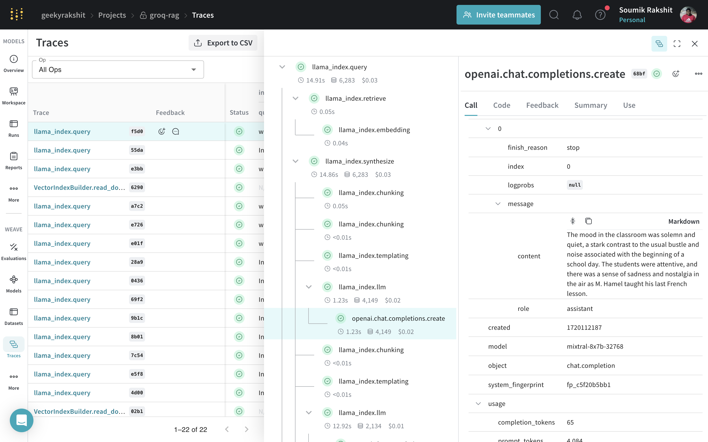

# Building the Query Engine

[](https://colab.research.google.com/github/wandb/weave/blob/master/docs/docs/guides/cookbooks/llamaindex_rag_ncert/notebooks/01_rag_engine.ipynb)

## Using Weave to trace LlamaIndex calls

Weave is integrated with LlamaIndex to simplify the tracking and logging of all LlamaIndex calls. To get started, simply call `weave.init()` at the beginning of your script.

```python
import weave

weave.init(project_name="groq-rag")
```

## Using GroqCloud LLMs with LlamaIndex

[GroqCloud](https://groq.com/) is an LLM cloud service provider that lets us use open-source LLMs like Llama3, Mixtral, Gemma, etc. The GroqCloud models run on their propreitary **Language Processing Unit** or **LPU** which has a deterministic, single core streaming architecture that sets the standard for genAI inference speed with predictable and repeatable performance for any given workload.

We can use GroqCloud models with LlamaIndex:

```python
import os
from llama_index.llms.groq import Groq

llm = Groq(
    model="llama3-8b-8192",
    api_key=os.environ.get("GROQ_API_KEY")
)
```

## Fetching and Loading the Vector Store Index

First we create a service context for configuring the vector index store.

```python
from llama_index.embeddings.huggingface import HuggingFaceEmbedding

embed_model = HuggingFaceEmbedding(
    model_name="BAAI/bge-small-en-v1.5"
)

service_context = ServiceContext.from_defaults(
    embed_model=embed_model, llm=llm
)
```

Next, we fetch the W&B vector index artifact and load back the index.

```python
import wandb

# We use `wandb.Api` to fetch the artifacts, this ensures that we don't
# create a new W&B run for every query. The queries will be tracked by Weave.
artifact = wandb.Api().artifact(
    "geekyrakshit/groq-rag/ncert-flamingoes-prose-embeddings:latest"
)
artifact_dir = artifact.download()

# Load the vector index from storage
storage_context = StorageContext.from_defaults(
    persist_dir=artifact_dir
)
index = load_index_from_storage(
    storage_context, service_context=service_context
)
```

## Building the Query Engine

Now that the vector store index has been loaded, it can be referenced to query over user prompts and build our chatbot.

```python
query_engine = index.as_query_engine(
    service_context=service_context,
    similarity_top_k=10,
)
```

We can now query this query engine to fetch answers for question.

```python
import rich

query = """
what was the mood in the classroom when M. Hamel gave his last French lesson?
"""
response = query_engine.query(query).response

rich.print(response)
```

The output is:

```
The mood in the classroom was one of solemnity and quiet, a marked departure from the typical boisterousness and 
clamor that usually accompanied the start of a school day. The students were unusually focused, and there was an 
underlying current of sadness and wistfulness as M. Hamel conducted his final French lesson.
```

|  |
|---|
| Tracing is a powerful feature in [Weave](https://wandb.github.io/weave/guides/tracking/tracing) that allows you to track the inputs and outputs of functions seamlessly. Weave being integrated with LlamaIndex ensures that all LlamaIndex calls are traced automatically by including `weave.init()` before the calls. |

## What's next?

- [Building a Better Assitant using Prompt Engineering](./prompt_engineering.md)
- [Building an Evaluation Pipeline](./evaluation.md)
