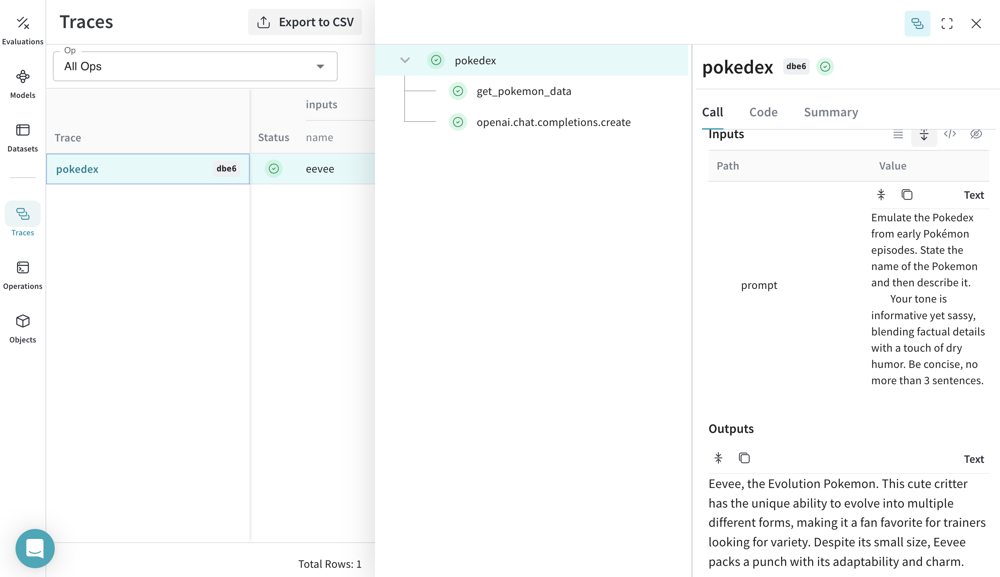

# OpenAI

## Tracing

It’s important to store traces of LLM applications in a central database, both during development and in production. You’ll use these traces for debugging and to help build a dataset of tricky examples to evaluate against while improving your application.

Weave can automatically capture traces for the [openai python library](https://platform.openai.com/docs/reference/python-sdk?lang=python). 

Start capturing by calling `weave.init(<project-name>)` with a project name your choice.

```python
from openai import OpenAI
import weave
client = OpenAI()
# highlight-next-line
weave.init('emoji-bot')

response = client.chat.completions.create(
  model="gpt-4",
  messages=[
    {
      "role": "system",
      "content": "You are AGI. You will be provided with a message, and your task is to respond using emojis only."
    },
    {
      "role": "user",
      "content": "How are you?"
    }
  ],
  temperature=0.8,
  max_tokens=64,
  top_p=1
)
```

[](https://wandb.ai/_scott/emoji-bot/weave/calls)

## Track your own ops

Wrapping a function with `@weave.op` starts capturing inputs, outputs and app logic so you can debug how data flows through your app. You can deeply nest ops and build a tree of functions that you want to track. This also starts automatically versioning code as you experiment to capture ad-hoc details that haven't been committed to git.

Simply create a function decorated with [`@weave.op`](/guides/tracing/ops) that calls into [openai python library](https://platform.openai.com/docs/reference/python-sdk?lang=python).

In the example below, we have 2 functions wrapped with op. This helps us see how intermediate steps, like the retrieval step in a RAG app, are affecting how our app behaves.

```python
# highlight-next-line
import weave
from openai import OpenAI
import requests, random
PROMPT="""Emulate the Pokedex from early Pokémon episodes. State the name of the Pokemon and then describe it.
        Your tone is informative yet sassy, blending factual details with a touch of dry humor. Be concise, no more than 3 sentences. """
POKEMON = ['pikachu', 'charmander', 'squirtle', 'bulbasaur', 'jigglypuff', 'meowth', 'eevee']
client = OpenAI()

# highlight-next-line
@weave.op
def get_pokemon_data(pokemon_name):
    # highlight-next-line
    # This is a step within your application, like the retrieval step within a RAG app
    url = f"https://pokeapi.co/api/v2/pokemon/{pokemon_name}"
    response = requests.get(url)
    if response.status_code == 200:
        data = response.json()
        name = data["name"]
        types = [t["type"]["name"] for t in data["types"]]
        species_url = data["species"]["url"]
        species_response = requests.get(species_url)
        evolved_from = "Unknown"
        if species_response.status_code == 200:
            species_data = species_response.json()
            if species_data["evolves_from_species"]:
                evolved_from = species_data["evolves_from_species"]["name"]
        return {"name": name, "types": types, "evolved_from": evolved_from}
    else:
        return None

# highlight-next-line
@weave.op
def pokedex(name: str, prompt: str) -> str:
    # highlight-next-line
    # This is your root op that calls out to other ops
    # highlight-next-line
    data = get_pokemon_data(name) 
    if not data: return "Error: Unable to fetch data"
    response = client.chat.completions.create(
        model="gpt-3.5-turbo",
        messages=[
            {"role": "system","content": prompt},
            {"role": "user", "content": str(data)}
        ],
        temperature=0.7,
        max_tokens=100,
        top_p=1
    )
    return response.choices[0].message.content

# highlight-next-line
weave.init('pokedex-openai')
# Get data for a specific Pokémon
pokemon_data = pokedex(random.choice(POKEMON), PROMPT)
```

Navigate to Weave and you can click `get_pokemon_data` in the UI to see the inputs & outputs of that step.

[](https://wandb.ai/_scott/pokedex-openai/weave)

## Create a `Model` for easier experimentation

Organizing experimentation is difficult when there are many moving pieces. By using the [`Model`](/guides/models) class, you can capture and organize the experimental details of your app like your system prompt or the model you're using. This helps organize and compare different iterations of your app. 

In addition to versioning code and capturing inputs/outputs, [`Model`](/guides/models)s capture structured parameters that control your application’s behavior, making it easy to find what parameters worked best. You can also use Weave Models with `serve`, and [`Evaluation`](/guides/evaluations)s.

In the example below, you can experiment with `model` and `system_message`. Every time you change one of these, you'll get a new _version_ of `GrammarCorrectorModel`. 

```python
import weave
from openai import OpenAI

weave.init('grammar-openai')

class GrammarCorrectorModel(weave.Model): # Change to `weave.Model`
  model: str
  system_message: str

  @weave.op()
  def predict(self, user_input): # Change to `predict`
    client = OpenAI()
    response = client.chat.completions.create(
      model=self.model,
      messages=[
          {
              "role": "system",
              "content": self.system_message
          },
          {
              "role": "user",
              "content": user_input
          }
          ],
          temperature=0,
    )
    return response.choices[0].message.content


corrector = GrammarCorrectorModel(
    model="gpt-3.5-turbo-1106",
    system_message = "You are a grammar checker, correct the following user input.")
result = corrector.predict("That was so easy, it was a piece of pie!")
print(result)
```

[](https://wandb.ai/_scott/grammar-openai/weave/calls)

## Usage Info

The OpenAI calls return usage info as a default when `stream=False`. Weave will track this usage info and log it to weave to render token counts and cost of the call.

In case you set `stream=True`, we will automatically patch the call execution with `stream_options={"include_usage": True}` argument. This will return the usage info in the last chunk to be rendered in the UI. As a user, the stream iterator will not contain this info.

If you explicitly set `stream=True` and `stream_options={"include_usage": True}`, the returned stream object will contain the usage info. If you don't want to track the usage info you need to explicitly set `stream_options={"include_usage": False}`.

## Support for deprecated function calling

OpenAI deprecated the `functions` argument in favor of `tool_calls`. Since frameworks like Langchain, LlamaIndex, etc., still support this argument our OpenAI weave integration will trace if you pass list of function schemas to `functions` argument. 
